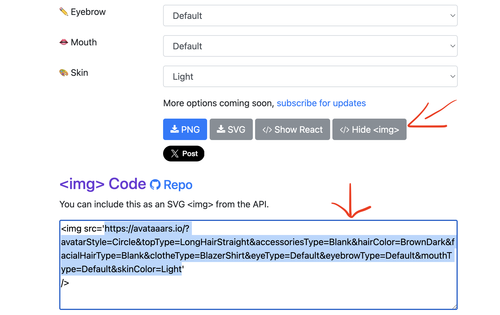

# 📸 SQL Basics mit instagram 

Wir haben ein sozialies Netzwerk aufgesetzt, auf welchem wir Accounts, Posts und Kommentare erstellen können. Das Netzwerk findest du unter: 
https://playgroundinsta.coffee-journal.com/feed
  
Deine Aufgabe ist es nun, dieses Netzwerk mit Daten zu befüllen. Nutze dazu geeignete SQL Befehle wie `INSERT`, `SELECT`, `UPDATE` und `DELETE`. Die SQL Befehle kannst du unter https://sqlproject.coffee-journal.com/exercises/5 ausführen. Dort siehtst du ein Query editor, wie auch bereits im Projekt und kannst die SQL Befehle direkt ausführen.

**Notiere dir zu jeder Aufgabe den SQL-Befehl, den du verwendet hast**

## Teil 1: Dein Profil & Dein Content (INSERT) 

**1 - Erstelle dein eigenes Konto**  
Schaue dir die Datenstruktur an und überlege dir, wie du einen Benutzer machen kannst. Als Profilbild kannst du diese Seite verwenden: https://getavataaars.com/ Du brauchst dabei nur die URL, welche du mit klick uf "show png" anschauen kannst. Dir wird dann das image tag angezeigt, stelle aber sicher dass du nur die url kopierst. So wie unten beschrieben. Wenn du deinen Account gemacht hast, solltest du ihn auf dem Netzwerk sehen.
 

**2 - Veröffentliche einen ersten Beitrag**  
Suche ein Bild, welches du posten kannst. Das Bild wird als URL eingefügt. Finde dazu ein Bild im Internet, wähle dann mit rechtsklick "url kopieren" und füge das geeignet in die Tabellenstruktur ein.
  

**!Content Richtlinien!**
**Kein Content zu Rassismus, Sexismus, Gewalt oder Diskriminierung. Humor darf sein, aber bitte mit dem nötigen Taktgefühl**

**3 - Kommentiere einen Beitrag** 
Finde einen Beitrag und schreibe einen Kommentar.

**4 - Schreibe eine Nachricht**
Schreibe eine Nachricht an einen beliebigen account.

**5 - Für andere Benutzer posten**
Wie könntest du einen Post im Namen eines anderen Benutzers erstellen?

## Teil 2: Beiträge anzeigen (INSERT / SELECT)

**6 - Lass dir den Feed anzeigen** 
Schreibe ein Query, welches dir den aktuellen Feed anzeigt.

**7 - Finde den Account deines Sitznachbarn** 
Suche in der Datenbank gezielt den Account deines Sitznachbarns. Notiere dier die `id`!

**8 - Posts finden** 
- Finde alle Posts, welche in Thun gemacht wurden
- Finde alle Posts, welche mehr als 1000 Likes haben
- Finde alle Posts, welche zwischen 500 und 1000 Likes haben

**9 - Schau dir die Beiträge deines Nachbarn an:** 
Lass dir nur die Posts anzeigen, die von der `user_id` deines Sitznachbarn erstellt wurden.

**10 - Komentare anzeigen** 
Schaue dir die Kommentare unter deinem Post an.

**11 - Accounts finden**
- Finde alle accounts, welche mit "leo" beginnen
- Finde alle accounts, welche "emma" im Namen haben.

## Teil 3: Likes / Edits / Mehr Select

**12 - Verteile ein paar Likes** 
Suche dir 2-3 andere Beiträge aus dem Feed aus und erhöhe deren Like-Zahl um jeweils 1. *(Achtung: Denk unbedingt an die `WHERE`-Klausel, sonst likest du aus Versehen jeden Post in der Datenbank!)*

**13 - Verändere einen Post** 
Finde den Post, welchen du zu Beginn gemacht hast und ändere das bild oder die Beschreibung

**14 - Nachricht senden** 
Sende eine Chatnachricht an eine ander Person im Netzwerk

**15 - Inbox anzeigen** 
Schaue dir deine Inbox, um Nachrichten anzusehen.

**16 - Welcher Beitrag hat die meisten likes?** 
Finde den Beitrag, welcher die meisten likes hat.

