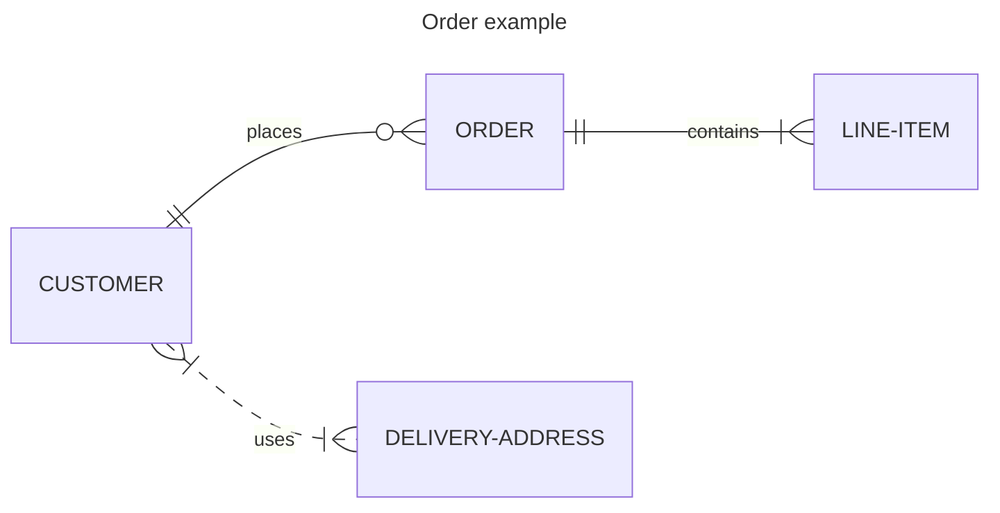
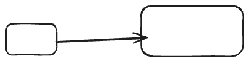

<script src="./extensions/md-extensions.js"></script>


# Titel
---
```javascript
const asdf = "true";
```
---
## Netflix

```mermaid
---
title: Order example
---
%%{init: {"er": {"layoutDirection": "LR"}}}%%
erDiagram
    direction LR

    CUSTOMER ||--o{ ORDER : places
    ORDER ||--|{ LINE-ITEM : contains
    CUSTOMER }|..|{ DELIVERY-ADDRESS : uses

```
---

---
